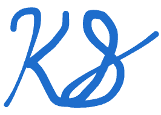

*Be curious. Be passionate. Be generous. Love deeply.*

Yay! You made it to my website!

I'm Kaitlyn. I'm super passionate about computing, creation, and people. I love cybersecurity, and I'm constantly looking for ways I can make the world a better place. Here you will find a frenzy of my thoughts, goings-on, & interests :)

Thanks for visiting! I'm glad you are here!

<!-- Current Read: __*The Cuckoo's Egg* by Clifford Stoll__ (the digital forensics gods told me I must read this)

Music Rec: __*Float On* by Modest Mouse__ (such a happy, glorious, & wonderful song) -->

 

